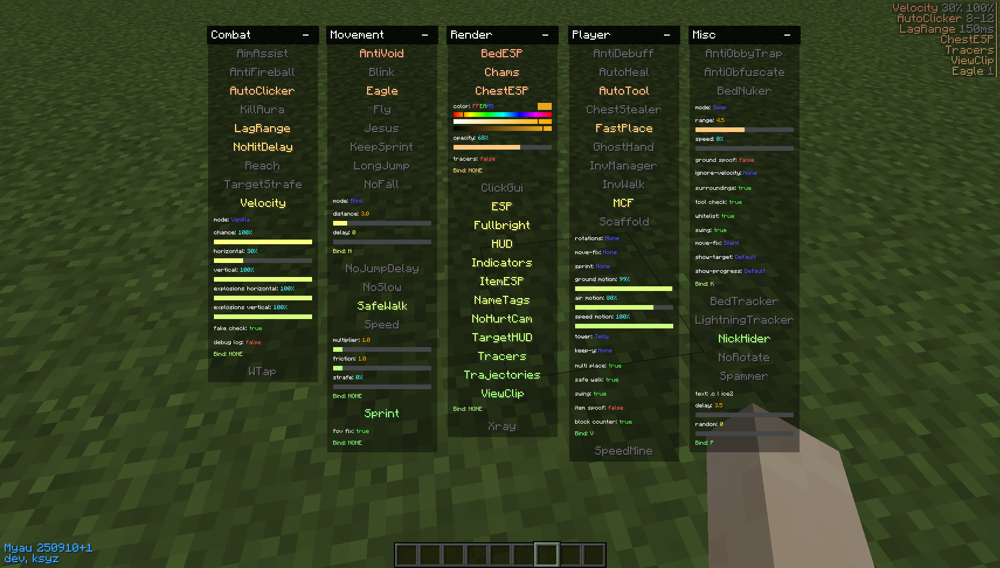

# InjectMyau

Myau for Minecraft 1.8.9, loaded into a game that is already running instead of installed as a mod.

The point of doing it this way is that it works on launchers that will not take a mod file: Badlion
and Lunar ship their own closed clients, and neither has a mods folder you can drop something into.
An injector does not need one. Start the game, press a button, and the client is inside it.

Forge still works too — the same build runs there, and that is the easiest place to develop against.



## Layout

```
InjectMyau/
├── OpenMyau-Inject/    the client itself (Java, Gradle, Forge 1.8.9)
└── myau-natives/       the loader and the injected DLL (C++, CMake, Windows)
```

The two build separately and meet once: the loader embeds the client jar as a resource, so the
Gradle build has to run first and the CMake build picks its output up from
`../OpenMyau-Inject/build/libs`.

## Requirements

| | |
|---|---|
| Building the client | JDK 17 |
| The client itself | targets Java 8 — Gradle handles this with a toolchain, no second JDK needed |
| Building the loader | CMake 3.15+, Visual Studio 2022 (or another MSVC toolchain), Windows |
| Running | Windows, 64-bit |

JDK 17 is not a preference. The Gradle build pulls in `architectury-pack200`, which refuses to run
on anything below 16, and 21 and above break other parts of the toolchain. Point `JAVA_HOME` at a
17 and leave it.

## Building

### 1. The client

```bash
cd OpenMyau-Inject
./gradlew build
```

The jar lands in `OpenMyau-Inject/build/libs/`. On Windows use `gradlew.bat`.

### 2. The loader

```bash
cd myau-natives
cp urls.cmake.example urls.cmake
cmake -S . -B build -G "Visual Studio 17 2022" -A x64 -DJAVA_INCLUDE="<your-jdk>/include"
cmake --build build --config Release
```

`urls.cmake` is where the loader gets the addresses it downloads the payload and the changelog
from, one entry per release channel. It is not in the repository — copy the example, put your own
hosting in it, and it stays local. Without it the build falls back to `example.invalid` and the
loader has nowhere to download from. Passing `-DPAYLOAD_URL=` and friends on the command line works
too and overrides the file.

`JAVA_INCLUDE` is only needed if `JAVA_HOME` is not already pointing at a JDK — the build reads it
from there by default. It has to be a JDK and not a JRE, because the injected DLL is a JVMTI agent
and needs `jni.h` and `jvmti.h`.

The configure step fails outright if it cannot find a client jar. That is deliberate: a loader with
no client in it looks like it works and then does nothing.

The result is `myau-natives/build/Release/myau_loader.exe`, with the DLL and the client jar built
into it. It is the only file you need to keep.

## Using it

1. Start Minecraft 1.8.9 — Forge, Badlion or Lunar.
2. Get to the main menu. Do not join a server yet.
3. Run `myau_loader.exe` and press **Load**.

The loader looks for a running `java.exe` or `javaw.exe` that is a Minecraft process, writes the DLL
and the client jar to `%TEMP%`, and attaches. It says **Loaded** when the client is in.

Once it is in, `RSHIFT` opens the menu and `.help` in chat lists the commands.

Injecting twice into the same game does nothing the second time — the classes are already loaded and
will not be read again. To pick up a new build, close Minecraft, start it again, and inject the new
loader.

### If something goes wrong

The client writes to `%TEMP%\myau-native.log`, and that is the first place to look. It records every
hook it installed and every name it failed to resolve. `System.out` is not a substitute: Badlion
sends it somewhere you cannot read.

## How it works

The loader is a JVMTI agent. It attaches to the running JVM and asks it to hand back the classes it
has already loaded so they can be rewritten — `ClassFileLoadHook` plus `RetransformClasses`. The
rewriting is plain ASM, injecting calls to the client's own callbacks at chosen points in vanilla
methods. There are no Mixins at runtime.

The one genuinely awkward part is that the three launchers do not agree on what anything is called:

| | Classes | Members |
|---|---|---|
| Forge | MCP (`net.minecraft.client.Minecraft`) | SRG (`func_71410_x`) |
| Lunar | MCP | MCP (`getMinecraft`) |
| Badlion | obfuscated (`ave`) | obfuscated (`aw`) |

So the client ships mapping tables and remaps its own references as its classes load, in whichever
direction that particular game needs. A Mixin build of the same source exists alongside the injected
one and is what runs in a development environment, where Forge names everything itself.

## Development

`./gradlew runClient` starts a Forge development client with the Mixin build, which is a much
shorter loop than rebuilding the loader for every change. The injected path and the Mixin path are
separate implementations of the same hooks, so anything touching one usually has to touch the other
— they are `src/main/java/myau/inject/` and `src/main/java/myau/mixin/`.

## Credits

Based on Myau 250910, and on [OpenMyau](https://github.com/60124808866/OpenMyau). The click GUI came
from Raven b3 by blowsy. Various modules are ported from Raven, Rise and Astralis.

## License

GPL-3.0. See [LICENSE](LICENSE).

This program is free software: you can redistribute it and/or modify it under the terms of the GNU
General Public License as published by the Free Software Foundation, either version 3 of the
License, or (at your option) any later version.

It is distributed in the hope that it will be useful, but WITHOUT ANY WARRANTY; without even the
implied warranty of MERCHANTABILITY or FITNESS FOR A PARTICULAR PURPOSE. See the GNU General Public
License for more details.
